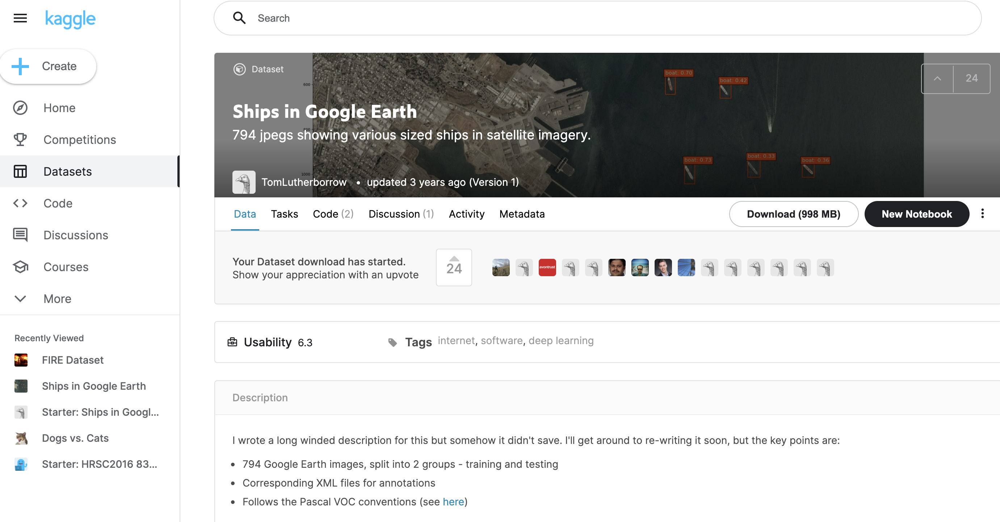
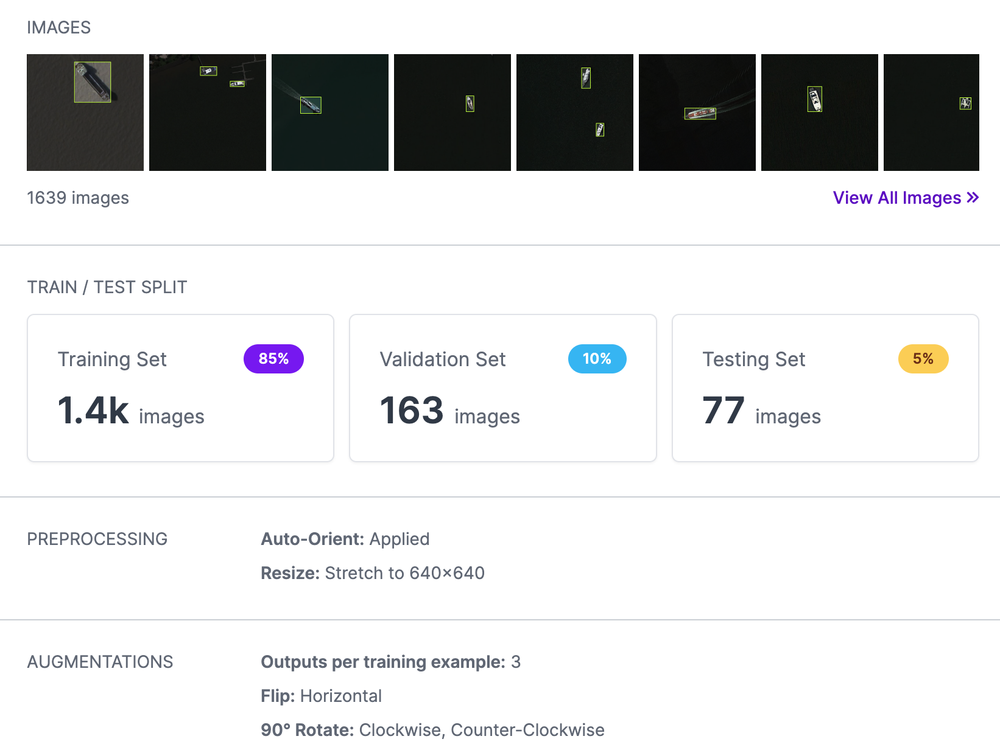
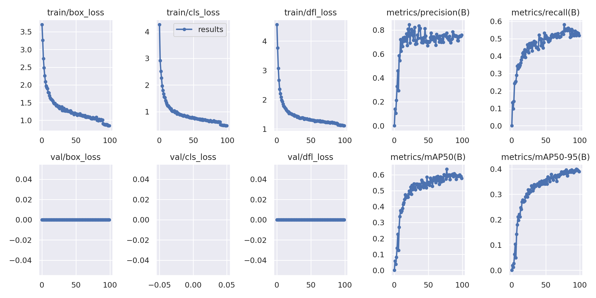
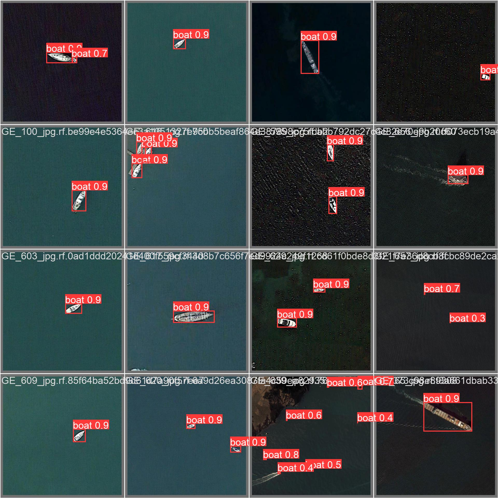

# kaggle-ships-in-Google-Earth
This project demonstrates the use of [YOLOv8](https://github.com/ultralytics/ultralytics) to perform detection of ships on a Google Earth dataset.

## Dataset
The source dataset used is on Kaggle at [Ships in Google Earth](https://www.kaggle.com/tomluther/ships-in-google-earth). This dataset consists of images extracted from Google Earth which are approximately 30 to 50cm resolution. Images generally consist of a range of sizes of ship/boat against the blank ocean background, but some images are captured with ships close to the shoreline or with multiple clustered ships. Each ship is annotated with a bounding box in Pascal VOC (XML) format.

## Annotation conversion
YOLOv8 requires images in a specific annotation format. To transform the annotations from Pascal VOC to YOLOv8 format I uploaded the dataset to [Roboflow](https://roboflow.com/) as Roboflow allows transormation of the annotations to the required format. I also rebalanced the dataset into train/validation/test splits with a 70%/20%/10% split (note these % change after augmenting the test images). I applied three augmentations to the training images which are appriate for aerial imagery: a horizontal flip and 2x rotations. This increased the training set size threefold to approximately 1.4k images. I also resized all images to 640x640 since this is the required size for the YOLOv8m model. This dataset is publicly available [here](https://app.roboflow.com/robin-public/kaggle-ships-in-google-earth-dfqwt/3)

## Training YOLOv8
Roboflow provide ready to use training notebooks, and I used the [YOLOv8 notebook](https://github.com/roboflow/notebooks/blob/main/notebooks/train-yolov8-object-detection-on-custom-dataset.ipynb). The notebook is provided here in the file `yolov8-kaggle-ships.ipynb`. Training was performed on Google Colab Pro using a Tesla T4. The results of training for 100 epochs are below (yolov8n model):

## Validation metrics

| Metric      | yolov8n | yolov8m   |
| :----:      |  :----: | :----:    |
| Precision   | 0.919   | 0.943     |
| Recall      | 0.863   | 0.927     |
| mAP@.5      | 0.941   | 0.957     |
| mAP@.5:.95  | 0.683   | 0.720     |

Reviewing the predictions on the validation set I observed some errors, particularly for small boats. Overall the results are very encouraging:

Reviewing the test predictions (see notebook), in general ships are accurately detected with high confidence but some small and very long ships are missed.

## Summary
With relatively little time and effort I trained a YOLOv8 model for ship detection. For improved results, future work could include experimentation with alternative models, and augmentation strategies could be explored to help balance out some of the variations due to sea conditions (rough or calm), lighting (overcast or bright sunshine), ship density.