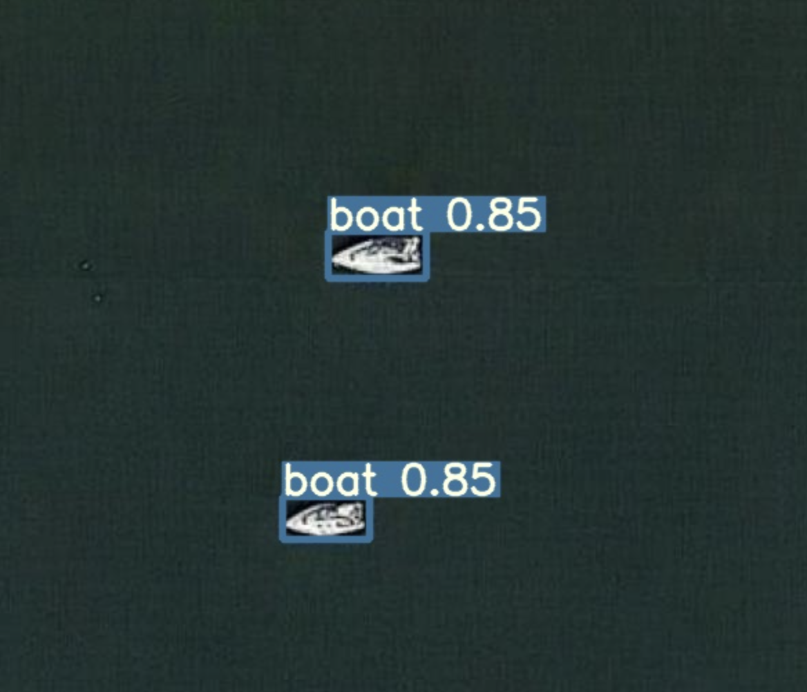
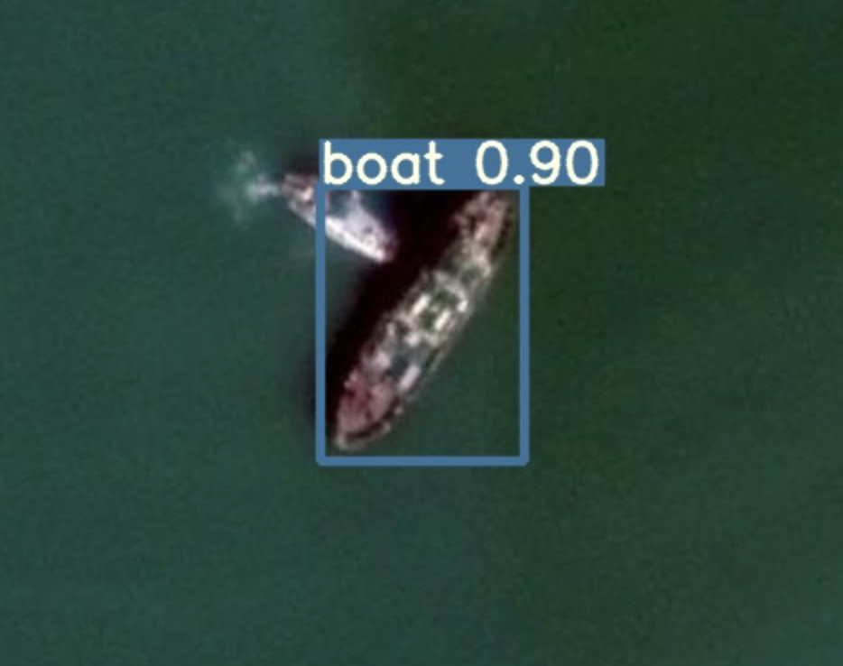
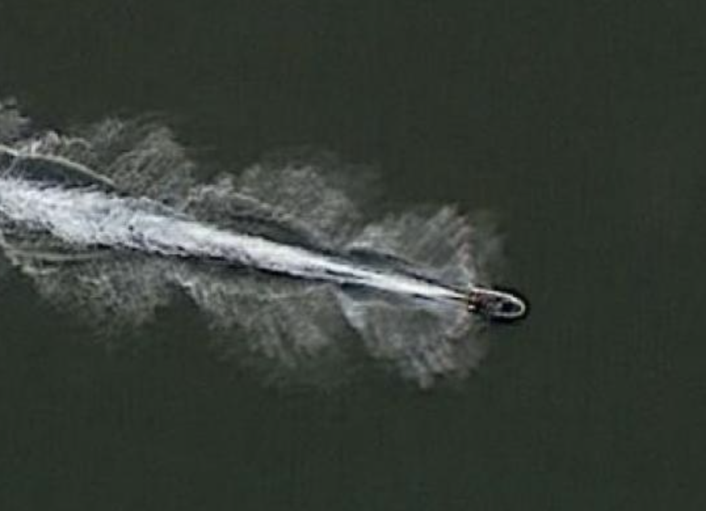

# kaggle-ships-in-Google-Earth-yolov5
Applying YOLOv5 to Kaggle Ships in Google Earth dataset.

## Dataset
The dataset used is hosted on Kaggle at [Ships in Google Earth](https://www.kaggle.com/tomluther/ships-in-google-earth). This dataset consists of images extracted from Google Earth, and images are typically 30 or 50cm resolution. Images generally consist of a range of sizes of ship/boat against the blank ocean background, but some images are captured with ships close to the shoreline or with multiple clustered boats. Each ship is annotated with a bounding box in Pascal VOC (XML) format.

For this project I use [YOLOv5](https://github.com/ultralytics/yolov5) to perform object detection, as this is a model that is easy to use and has good performance. YOLOv5 requires images in a specific annotation format, so to transform the annotations from Pascal VOC to YOLOv5 format I uploaded the dataset to [Roboflow](https://roboflow.com/) for reformatting. Roboflow provides a number of handy features including dataset insights & versioning, data pre and post processing (resizing & augmentations), and the ability to export datasets in the required YOLOv5 format (or many other formats).

The dataset on kaggle consist of 794 images, with 694 in a training set and 100 in test set. I uploading these to Roboflow as a single dataset of 794 images rebalanced the dataset into train/validation/test splits with 70%/20%/10% weighting. I applied three augmentations to the training images which are appriate for aerial imager: a horizontal flip and 2x rotations. This increased the training image set size threefold to approximately 1400 images. For pre-processing I resized all images to 640x640 since this is the expected size by the YOLOv5s model, which is the smallest and fasted of the YOLOv5 models.

## Training
Roboflow provide ready to use training notebooks, and I used the YOLOv5 notebook. The notebook is provided here in the file `yolov5-training.ipynb` and the final trained model is in the `model` folder. Training was performed on Google Colab Pro using a Tesla T4 and completed in approximately 21 mins. The results of training for 100 epochs are below:

- Precision: 0.857
- Recall: 0.787
- mAP@.5: 0.829
- mAP@.5:.95: 0.554

## Testing
The notebook shows the inferences performed on the hold-out test set. We see that for ships in the open water the model does well, even distinguishing a small moored boat:

However the model occasionally misses some obvious boats:

And a pontoon is mistaken for a boat:

## Conclusions
With relatively little time (1-2 hours including training) and effort a model was trained that provides decent performance for ships in open water. However some obvious errors and false positives are an issue. Future work could be performed to evaluate the balance of the dataset with regard to these poorly performing cases. Note also that YOLOv5s is the smallest available YOLOv5 model, and better metrics may be achieved with one of the [larger models](https://github.com/ultralytics/yolov5#pretrained-checkpoints). Experimentation with alternative augmentation strategies could be explored to help balance out some of the variations due to sea conditions (rough or calm), lighting (overcast or bright sunshine), ship density.